# Revision 

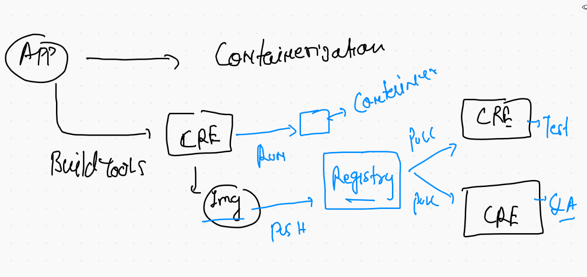


## COnfigure Docker engine in TCP socket 

```
[root@ip-172-31-70-200 ~]# cd  /etc/sysconfig/
[root@ip-172-31-70-200 sysconfig]# ls
acpid       clock     docker          init        modules          nfs            rpcbind      run-parts  sysstat.ioconf
atd         console   docker-storage  irqbalance  netconsole       raid-check     rpc-rquotad  selinux
authconfig  cpupower  grub            keyboard    network          rdisc          rsyncd       sshd
chronyd     crond     i18n            man-db      network-scripts  readonly-root  rsyslog      sysstat
[root@ip-172-31-70-200 sysconfig]# cat  docker
# The max number of open files for the daemon itself, and all
# running containers.  The default value of 1048576 mirrors the value
# used by the systemd service unit.
DAEMON_MAXFILES=1048576

# Additional startup options for the Docker daemon, for example:
# OPTIONS="--ip-forward=true --iptables=true"
# By default we limit the number of open files per container
OPTIONS="--default-ulimit nofile=1024:4096 -H tcp://0.0.0.0:2375"

# How many seconds the sysvinit script waits for the pidfile to appear
# when starting the daemon.
DAEMON_PIDFILE_TIMEOUT=10

```

## alternative to this  above

```
[root@ip-172-31-70-200 docker]# pwd
/etc/docker
[root@ip-172-31-70-200 docker]# ls
deamon.json  key.json
[root@ip-172-31-70-200 docker]# cat  deamon.json 
{

 "hosts": ["tcp://192.168.59.3:2375"]
}
[root@ip-172-31-70-200 docker]# 


```


### starting docker engine 

```
 systemctl daemon-reload  ; systemctl restart docker

```

## cleaning up docker engine 

```
70  docker  rm $(docker ps -aq) -f ; docker network prune 
  371  docker  network ls
  372  history 
  373  docker  rmi $(docker images -q) -f
  374  docker  images
  375  docker  ps -a
  376  docker network ls
  377  docker volume rm $(docker volume ls -q) -f
  378  docker  volume  ls
  379  docker  images ; docker ps -a ; docker network ls ; docker volume  ls
  
  ```
  
  ### docker volume 
  
  ```
  [ec2-user@ip-172-31-70-200 images]$ 
[ec2-user@ip-172-31-70-200 images]$ docker  volume  create ashuvol1 
ashuvol1
[ec2-user@ip-172-31-70-200 images]$ docker  volume ls 
DRIVER    VOLUME NAME
local     ashuvol1
[ec2-user@ip-172-31-70-200 images]$ docker  volume inspect  ashuvol1 
[
    {
        "CreatedAt": "2021-07-21T05:22:32Z",
        "Driver": "local",
        "Labels": {},
        "Mountpoint": "/var/lib/docker/volumes/ashuvol1/_data",
        "Name": "ashuvol1",
        "Options": {},
        "Scope": "local"
    }
]


```

### mysql as container 

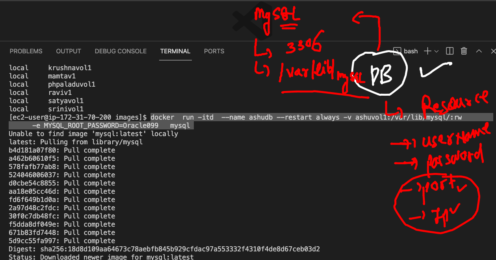

## login into DB container to access DB engine 

```
[ec2-user@ip-172-31-70-200 images]$ docker  exec -it  ashudb bash 
root@72adfff19ab2:/# cat  /etc/os-release 
PRETTY_NAME="Debian GNU/Linux 10 (buster)"
NAME="Debian GNU/Linux"
VERSION_ID="10"
VERSION="10 (buster)"
VERSION_CODENAME=buster
ID=debian
HOME_URL="https://www.debian.org/"
SUPPORT_URL="https://www.debian.org/support"
BUG_REPORT_URL="https://bugs.debian.org/"
root@72adfff19ab2:/# 
root@72adfff19ab2:/# mysql  -u  root  -p
Enter password: 
Welcome to the MySQL monitor.  Commands end with ; or \g.
Your MySQL connection id is 8
Server version: 8.0.26 MySQL Community Server - GPL

Copyright (c) 2000, 2021, Oracle and/or its affiliates.

Oracle is a registered trademark of Oracle Corporation and/or its
affiliates. Other names may be trademarks of their respective
owners.

Type 'help;' or '\h' for help. Type '\c' to clear the current input statement.

mysql> 
mysql> 
mysql> show databases;
+--------------------+
| Database           |
+--------------------+
| information_schema |
| mysql              |
| performance_schema |
| sys                |
+--------------------+
4 rows in set (0.00 sec)

mysql> create  database ashuDB ; 
Query OK, 1 row affected (0.01 sec)

mysql> show databases;
+--------------------+
| Database           |
+--------------------+
| ashuDB             |
| information_schema |
| mysql              |
| performance_schema |
| sys                |
+--------------------+
5 rows in set (0.00 sec)

mysql> 

```

## Bind Mount in COntainers 

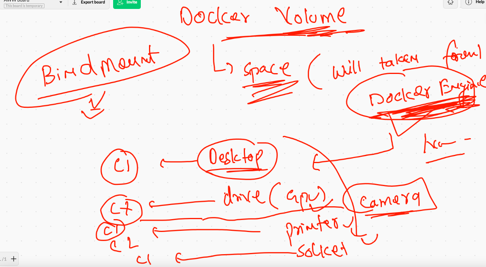

## example

```
[ec2-user@ip-172-31-70-200 images]$ docker  run -it --rm  -v  /etc:/mydata:ro  oraclelinux:8.3  bash 
Unable to find image 'oraclelinux:8.3' locally
8.3: Pulling from library/oraclelinux
dd34f38d274c: Pull complete 
Digest: sha256:af3182ee6c1e56f18fc1fecaf638da57d7c47233862e5c32f5ad723a6ab4c6db
Status: Downloaded newer image for oraclelinux:8.3
[root@9d24da521f69 /]# ls
bin  boot  dev  etc  home  lib  lib64  media  mnt  mydata  opt  proc  root  run  sbin  srv  sys  tmp  usr  var
[root@9d24da521f69 /]# cd mydata/
[root@9d24da521f69 mydata]# mkdir hello
mkdir: cannot create directory 'hello': Read-only file system
[root@9d24da521f69 mydata]# ls
DIR_COLORS               cron.monthly         hibinit-config.cfg  mke2fs.conf        python            skel
DIR_COLORS.256color      cron.weekly          host.conf           modprobe.d         rc.d              ssh
DIR_COLORS.lightbgcolor  crontab              hostname            modules-load.d     rc.local          ssl
GREP_COLORS              csh.cshrc            hosts               motd               rc0.d             statetab
GeoIP.conf               csh.login            hosts.allow         mtab               rc1.d             statetab.d
GeoIP.conf.default       dbus-1               hosts.deny          my.cnf             rc2.d             subgid
NetworkManager           default              id

```

### Portainer with Docker bind mount 

```
docker  run -itd --name webui --restart always -p 9000:9000 -v /var/run/docker.sock:/var/run/docker.sock  portainer/portainer:latest 

```

## COntainer RUn time Engine problems 


## Container orchestration engine 

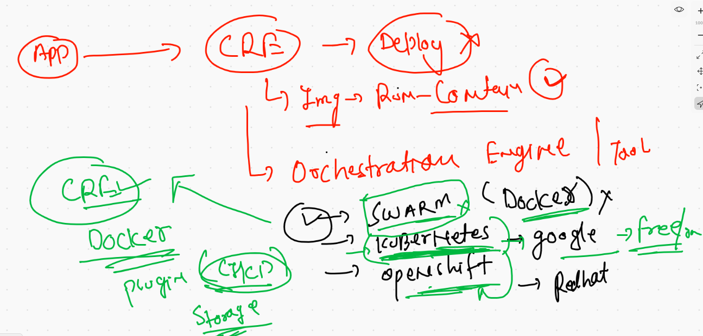

## Introduction to k8s 

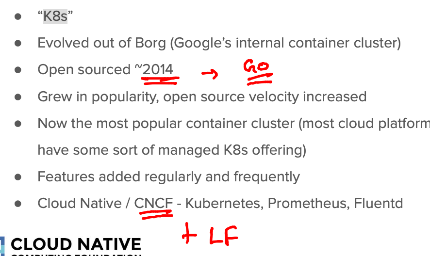


## k8s arch level 1 

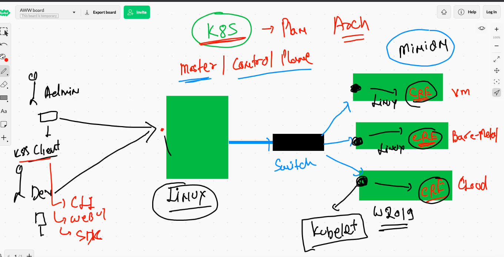

## k8s solved scheduling of containers problem 


## replication controller 

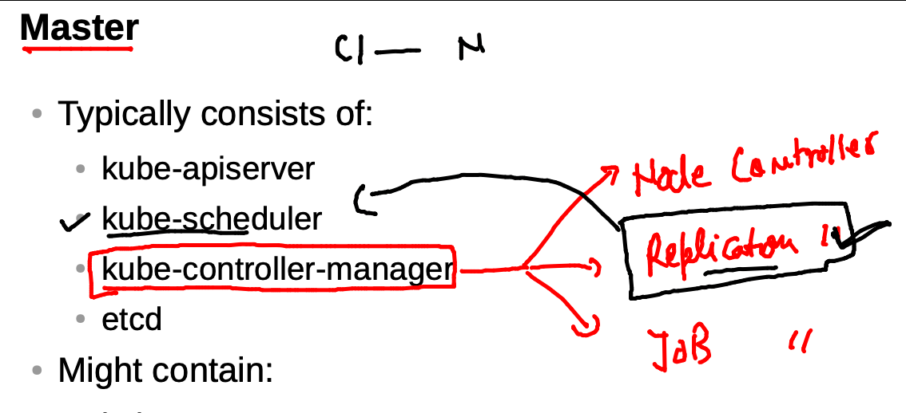

### RC 

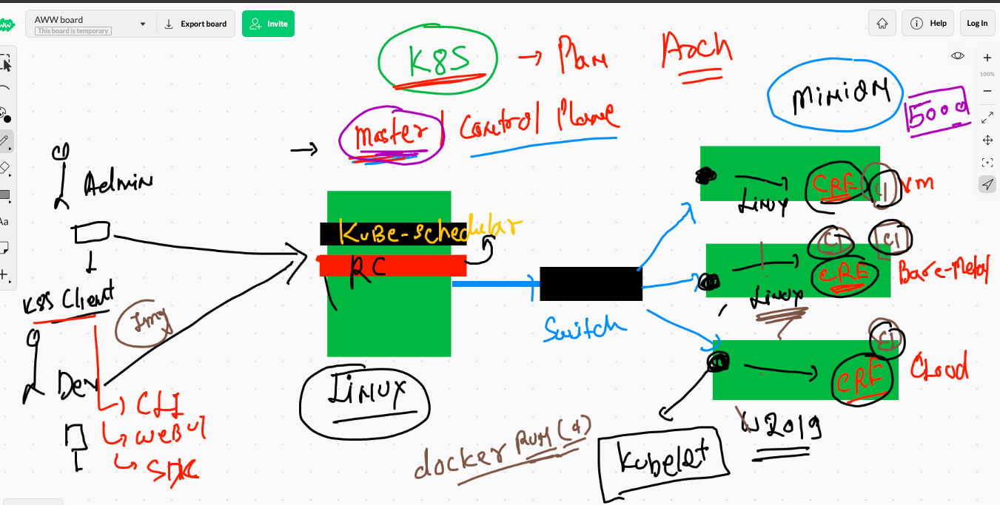

## Node controller 

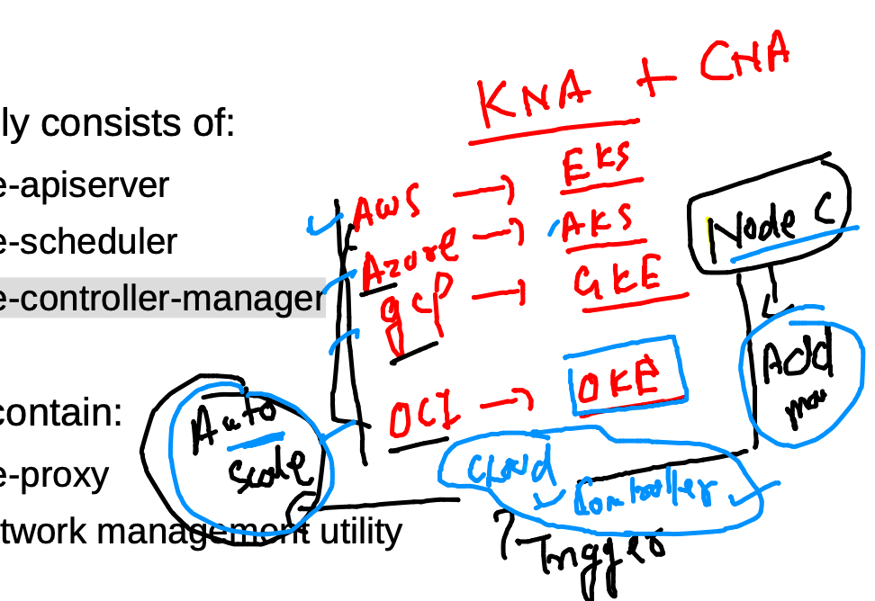

## nc again 

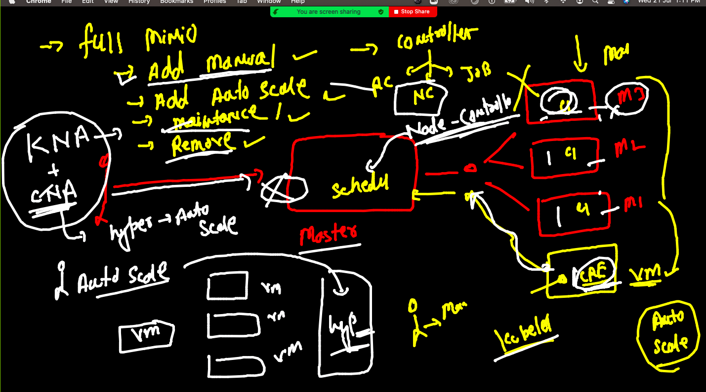

## kube-apiServer 

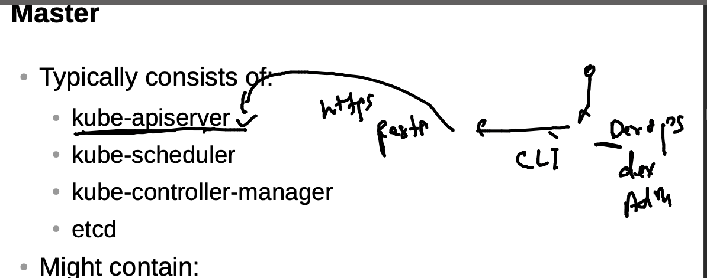

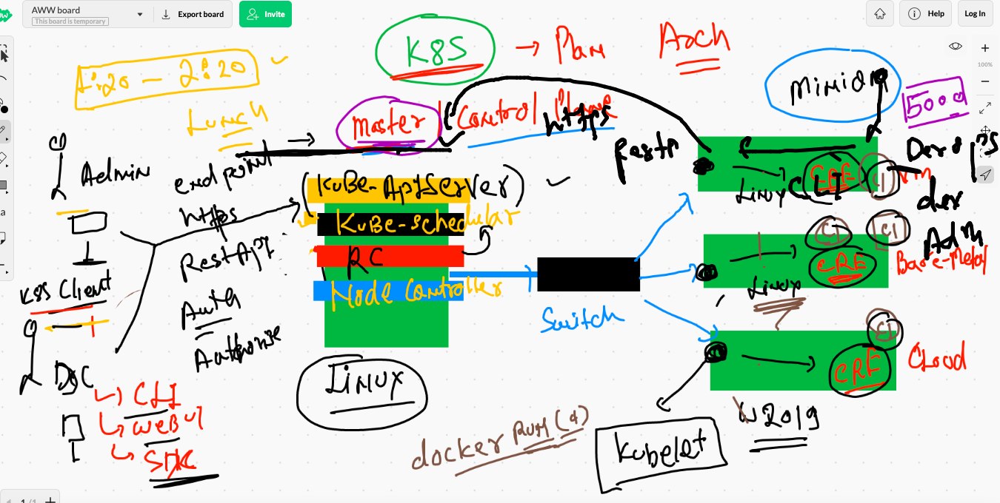

## ETcd 

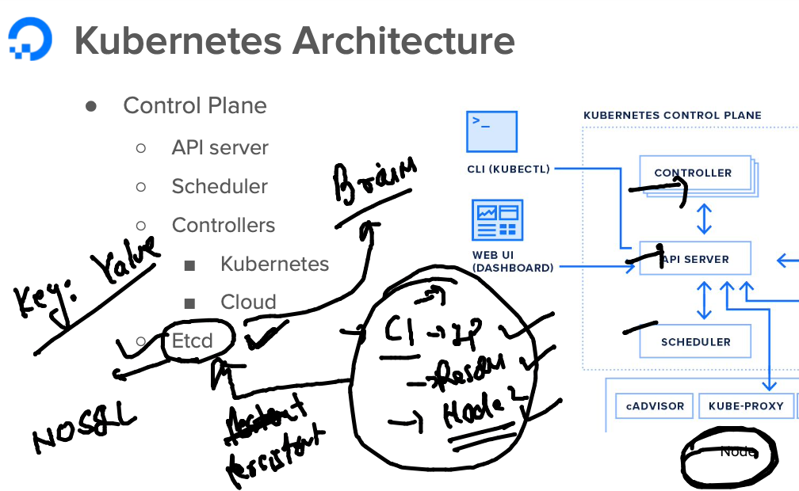

## kubernetes cluster deployment options 

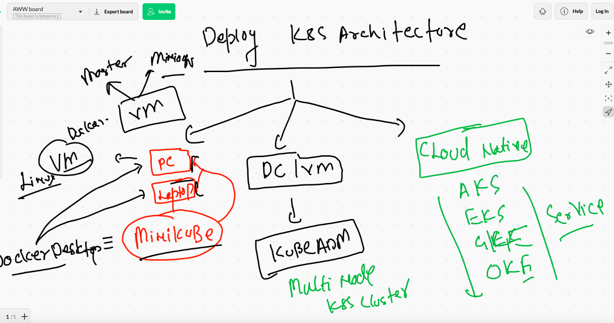


## Deploy k8s using minikube 

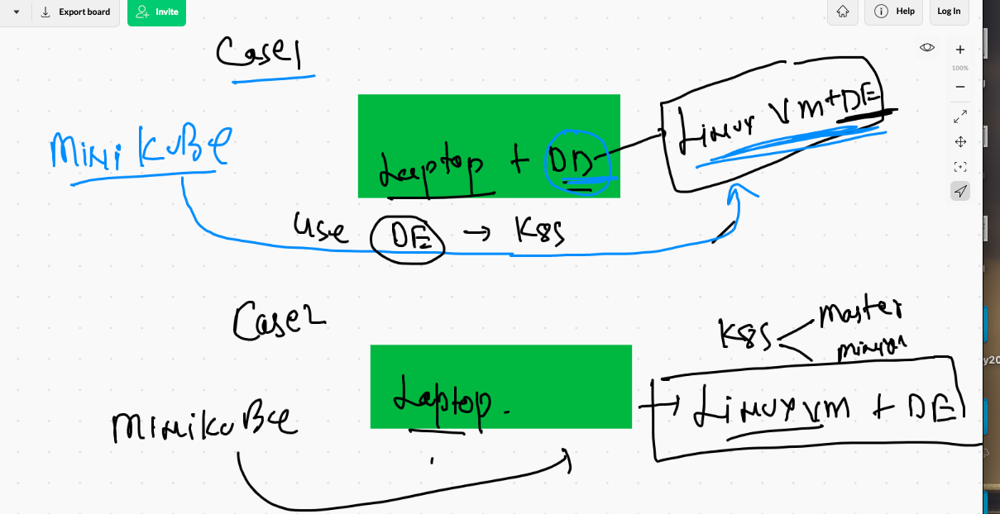


### Installing minikube 

```
❯ curl -LO https://storage.googleapis.com/minikube/releases/latest/minikube-darwin-amd64
  % Total    % Received % Xferd  Average Speed   Time    Time     Time  Current
                                 Dload  Upload   Total   Spent    Left  Speed
100 65.9M  100 65.9M    0     0  1975k      0  0:00:34  0:00:34 --:--:-- 1152k
❯ sudo install minikube-darwin-amd64 /usr/local/bin/minikube
Password:
❯ minikube version
minikube version: v1.22.0
commit: a03fbcf166e6f74ef224d4a63be4277d017bb62e

```

###  STARTING K8S CLSUTER 

```
❯ minikube  start  --driver=docker
😄  minikube v1.22.0 on Darwin 11.4
✨  Using the docker driver based on user configuration
👍  Starting control plane node minikube in cluster minikube
🚜  Pulling base image ...
💾  Downloading Kubernetes v1.21.2 preload ...
    > gcr.io/k8s-minikube/kicbase...: 361.09 MiB / 361.09 MiB  100.00% 1.59 MiB
    > preloaded-images-k8s-v11-v1...: 502.14 MiB / 502.14 MiB  100.00% 1.19 MiB
🔥  Creating docker container (CPUs=2, Memory=1988MB) ...
🐳  Preparing Kubernetes v1.21.2 on Docker 20.10.7 ...
    ▪ Generating certificates and keys ...| ^[[1- ^[[1| ^[[1- ^[[1/ ^R
^[[17~^[[17~^[[17~^[[
    ▪ Booting up control plane ...
    ▪ Configuring RBAC rules ...
🔎  Verifying Kubernetes components...
    ▪ Using image gcr.io/k8s-minikube/storage-provisioner:v5
🌟  Enabled addons: storage-provisioner, default-storageclass
🏄  Done! kubectl is now configured to use "minikube" cluster and "default" namespace by default

```

## k8s client software is kubectl 

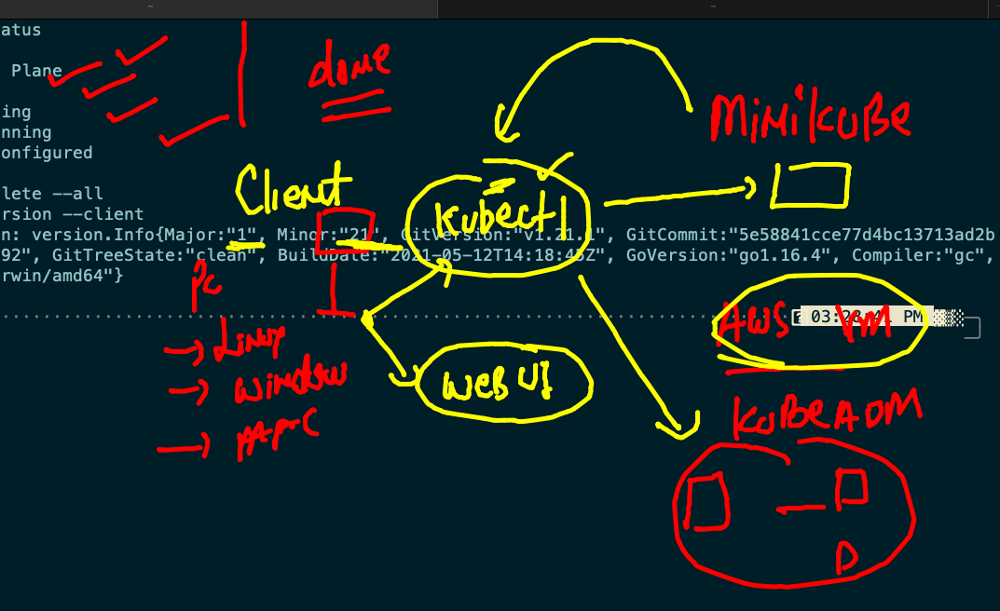

### connecting to kubernetes cluster 

```
❯ kubectl  get  nodes
NAME       STATUS   ROLES                  AGE   VERSION
minikube   Ready    control-plane,master   30m   v1.21.2
❯ kubectl  get  nodes  --kubeconfig  admin.conf
NAME         STATUS   ROLES                  AGE     VERSION
masternode   Ready    control-plane,master   6h18m   v1.21.3
minion1      Ready    <none>                 6h17m   v1.21.3
minion2      Ready    <none>                 6h16m   v1.21.3

```
## creating context with minikube and aditional cluster

```
❯ minikube stop
✋  Stopping node "minikube"  ...
🛑  Powering off "minikube" via SSH ...
🛑  1 nodes stopped.
❯ minikube status
minikube
type: Control Plane
host: Stopped
kubelet: Stopped
apiserver: Stopped
kubeconfig: Stopped

```

## kubeconfig file location in windwos and mac 

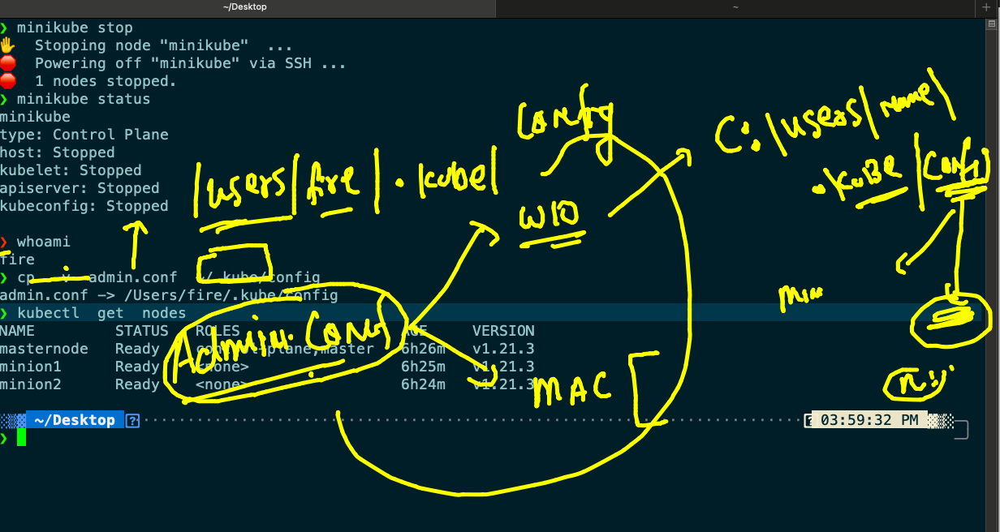

## minikube start

```
❯ minikube start
😄  minikube v1.22.0 on Darwin 11.4
✨  Using the docker driver based on existing profile
👍  Starting control plane node minikube in cluster minikube
🚜  Pulling base image ...
🔄  Restarting existing docker container for "minikube" ...
🐳  Preparing Kubernetes v1.21.2 on Docker 20.10.7 ...
🔎  Verifying Kubernetes components...
    ▪ Using image gcr.io/k8s-minikube/storage-provisioner:v5
🌟  Enabled addons: storage-provisioner, default-storageclass
🏄  Done! kubectl is now configured to use "minikube" cluster and "default" namespace by default
❯ kubectl  get  nodes
NAME       STATUS   ROLES                  AGE   VERSION
minikube   Ready    control-plane,master   45m   v1.21.2

```

## switching k8s contexts

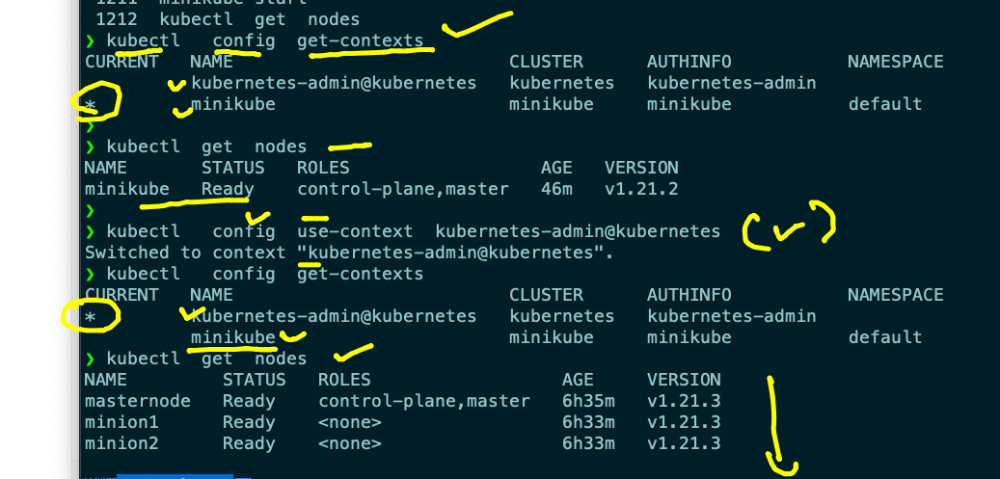

## steps to deployment any docker image to the k8s cluster 

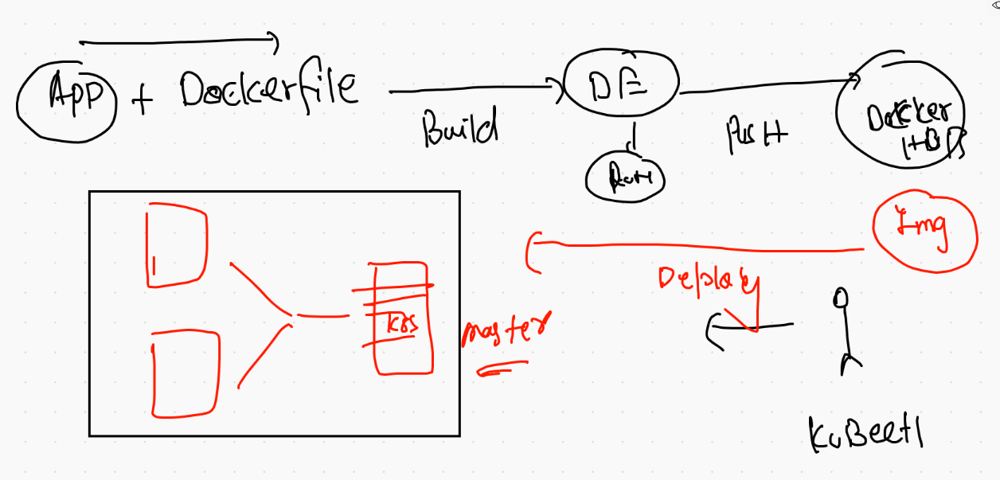

## pod vs containers

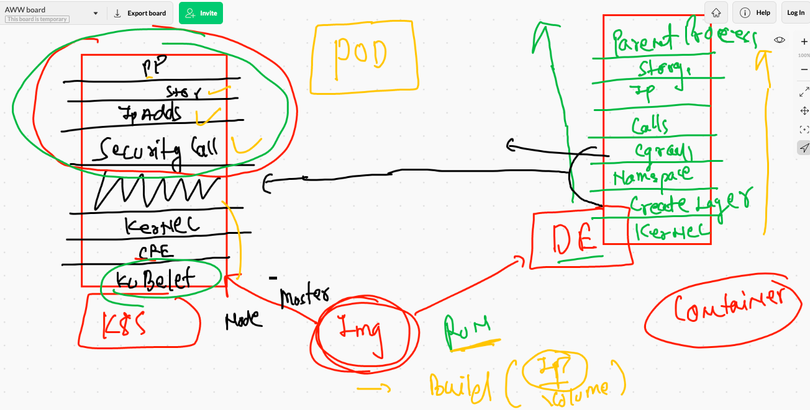

## pod in reality 

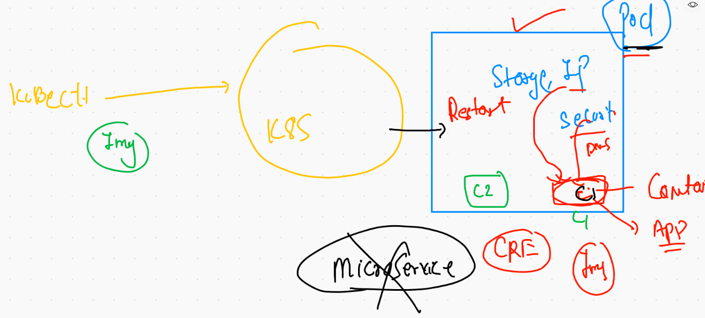

## Kubernetes as YAML 

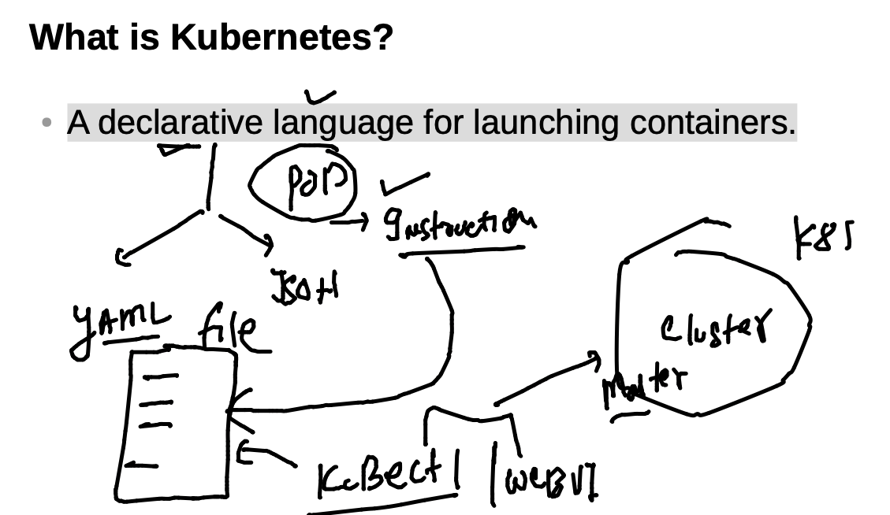

## POD Design explanation 

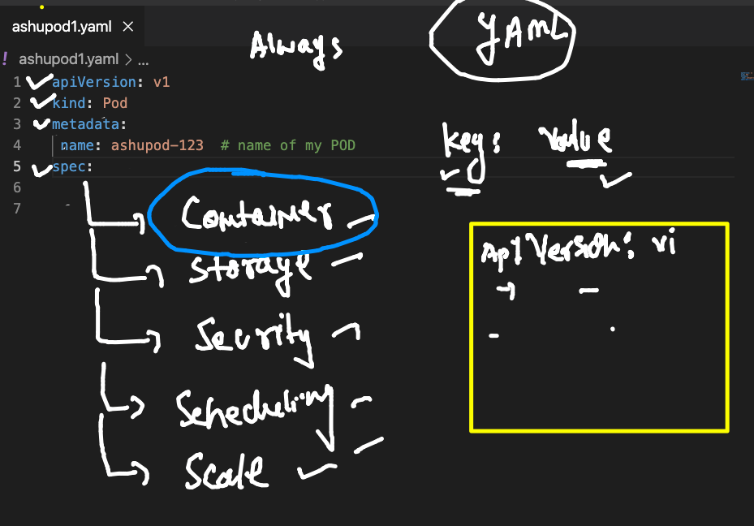


## first pod deployment 

```
1222  kubectl  apply -f  ashupod1.yaml --dry-run=client 
 1223  kubectl  apply -f  ashupod1.yaml
 1224  kubectl  get  pods 
 1225  kubectl  get  pods   ashupod-123  
 
```

## 

```
1235  kubectl  get po  ashupod-123
 1236  kubectl  logs -f   ashupod-123
 1237  kubectl  describe pod ashupod-123 
 1238  history
 1239  docker run  -d  --name x1  dockerashu/oraclepython:20thjuly2021v1 
 1240  docker  ps
 1241  docker logs -f  x1 
 1242  docker run  -itd  --name x2  dockerashu/oraclepython:20thjuly2021v1 
 1243  docker logs -f  x2 
 1244  history
 1245  docker logs -f  x1
 
 ```
 

