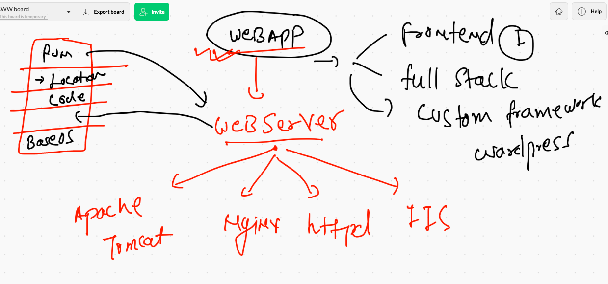
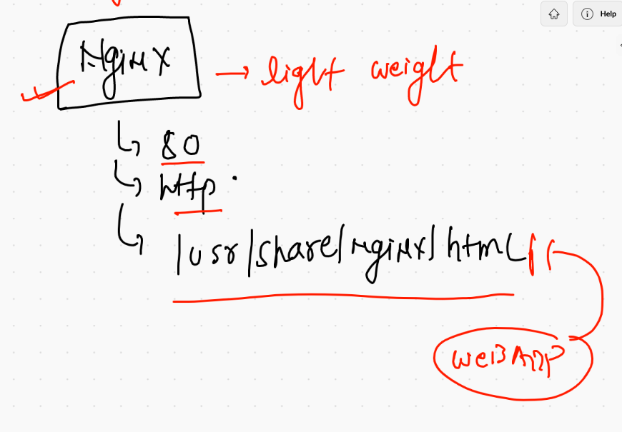
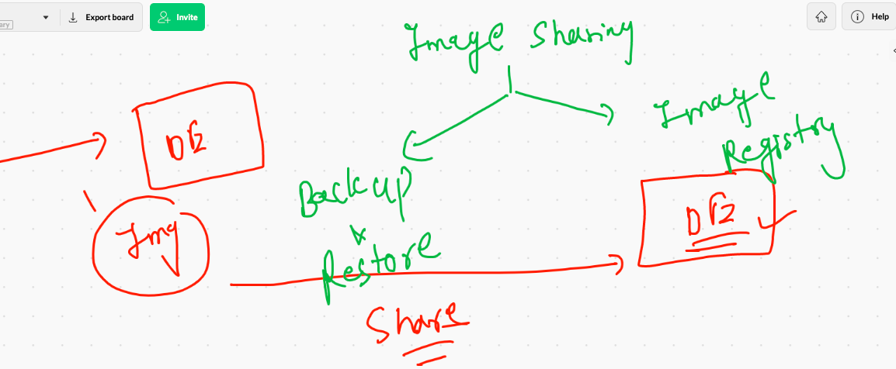
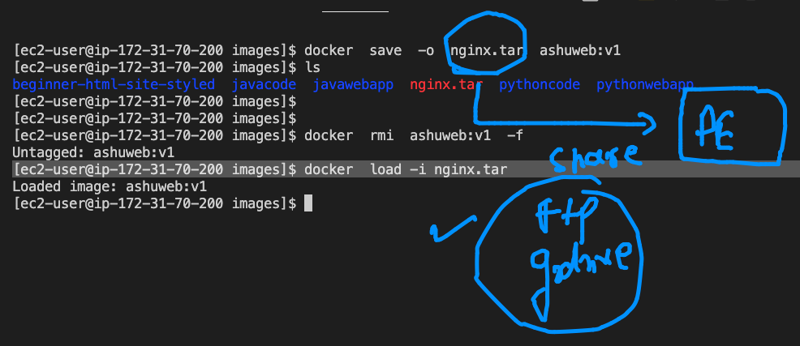
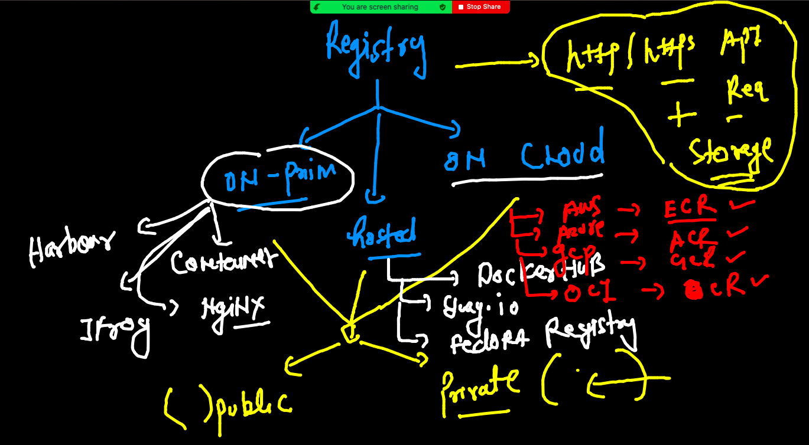
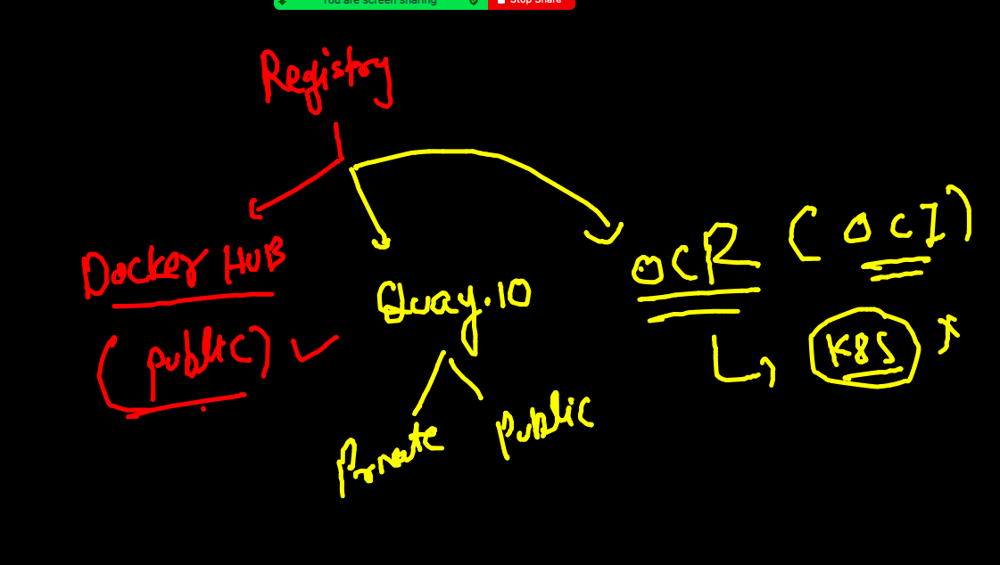
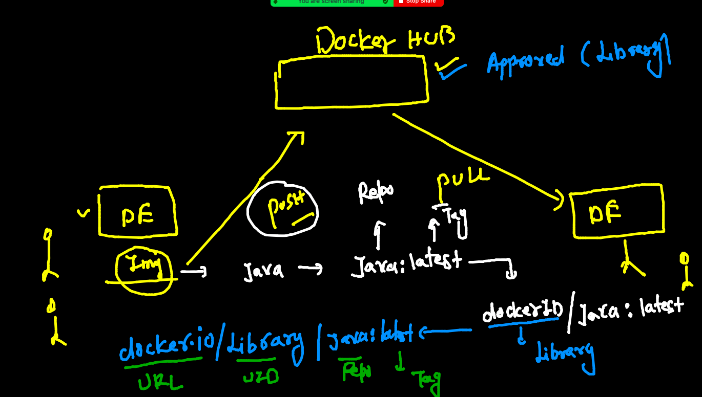

# day1 revision 

## snap 1


## snap 2 


## snap 3


## Resources distribution in containers


## cleaning up non running containers

```
[ec2-user@ip-172-31-70-200 images]$ docker rm $(docker  ps -f  "status=exited" -q)
d2ee75ee5de6
f9bf14e7d055
a3174063396d

```

## controlling resources in Container 


## demos

```
168  docker  run  -itd  --name  ashuxc3  ashupython:v3 
  169  docker  stats 
  170  history 
  171  docker  stats 
  172  history 
  173  docker run -itd --name ashuc2  --memory 100m   alpine ping fb.com
  174  docker stats
  175  history 
  176  docker run -itd --name ashuc3  --memory 100m --cpu-shares=20  alpine ping fb.com
  
```

## restart policy and json format 

```
4  docker  inspect  xx1   --format='{{.State.Status}}'
  195  docker  inspect  xx1   --format='{{.HostConfig.RestartPolicy.Name}}'
  196  docker  ps
  197  docker  inspect  srinivascg1  --format='{{.HostConfig.RestartPolicy.Name}}'
  198  docker  inspect  srinivascg1   --format='{{.State.Status}}'
  199  history 
  
```

## restart policy 

[docs](https://docs.docker.com/config/containers/start-containers-automatically/)


## Dockerfile with sample java code 

```
[ec2-user@ip-172-31-70-200 images]$ docker  build  -t  ashujava:v1  ./javacode  
Sending build context to Docker daemon  3.072kB
Step 1/8 : FROM openjdk
 ---> f695f4f55ff0
Step 2/8 : LABEL  name="ashutoshh"
 ---> Running in 8c4bbda4bfc3
Removing intermediate container 8c4bbda4bfc3
 ---> 4faaf1819b55
Step 3/8 : LABEL  email="ashutoshh@linux.com"
 ---> Running in f73067090ec8
Removing intermediate container f73067090ec8
 ---> 3b8ddcf08998
Step 4/8 : RUN mkdir /mycode
 ---> Running in b3ae772b7665
Removing intermediate container b3ae772b7665
 ---> ea884c6d1fdf
Step 5/8 : ADD  hello.java  /mycode/hello.java
 ---> 4052b1f741d4
Step 6/8 : WORKDIR  /mycode
 ---> Running in b47622301873
Removing intermediate container b47622301873
 ---> e1e1f1cd48fd
Step 7/8 : RUN javac  hello.java
 ---> Running in 56b170fcc4c5
Removing intermediate container 56b170fcc4c5
 ---> 9ef60293420b
Step 8/8 : CMD  ["java","myclass"]
 ---> Running in 15214aa50e85
Removing intermediate container 15214aa50e85
 ---> c82d04841998
Successfully built c82d04841998
Successfully tagged ashujava:v1

```

### creating container 

```
204  docker  build  -t  ashujava:v1  ./javacode  
  205  history 
  206  ls
  207  docker  images
  208  history 
  209  docker  run  -itd  --name ashujc1  ashujava:v1 
  210  docker  ps
  211  docker logs -f   ashujc1
  
  ```
  
  ## ANother example of dockerfile 
  
  ```
  [ec2-user@ip-172-31-70-200 javacode]$ docker  build  -t  ashujava:v2 -f ashujava.dockerfile   .
Sending build context to Docker daemon  4.096kB
Step 1/7 : FROM oraclelinux:8.4
 ---> 845809d06ce6
Step 2/7 : RUN dnf install java-1.8.0-openjdk.x86_64  java-1.8.0-openjdk-devel.x86_64 -y
 ---> Running in d83f5a4e1bf3
Oracle Linux 8 BaseOS Latest (x86_64)            10 MB/s |  37 MB     00:03    


```

### Dockerfile with webapp 

```
ec2-user@ip-172-31-70-200 images]$ git  clone https://github.com/mdn/beginner-html-site-styled
Cloning into 'beginner-html-site-styled'...
remote: Enumerating objects: 40, done.
remote: Total 40 (delta 0), reused 0 (delta 0), pack-reused 40
Receiving objects: 100% (40/40), 124.07 KiB | 15.51 MiB/s, done.
Resolving deltas: 100% (10/10), done.
[ec2-user@ip-172-31-70-200 images]$ ls
beginner-html-site-styled  javacode  javawebapp  pythoncode  pythonwebapp
[ec2-user@ip-172-31-70-200 images]$ ls beginner-html-site-styled/
CODE_OF_CONDUCT.md  images  index.html  LICENSE  README.md  styles


```

## list of web server



## Nginx info 



## Building docker images

```
[ec2-user@ip-172-31-70-200 beginner-html-site-styled]$ docker build -t ashuweb:v1  .
Sending build context to Docker daemon  63.49kB
Step 1/3 : FROM nginx
latest: Pulling from library/nginx
b4d181a07f80: Already exists 
66b1c490df3f: Pull complete 
d0f91ae9b44c: Pull complete 
baf987068537: Pull complete 
6bbc76cbebeb: Pull complete 
32b766478bc2: Pull complete 
Digest: sha256:353c20f74d9b6aee359f30e8e4f69c3d7eaea2f610681c4a95849a2fd7c497f9
Status: Downloaded newer image for nginx:latest
 ---> 4cdc5dd7eaad
Step 2/3 : WORKDIR /usr/share/nginx/html/
 ---> Running in 9fb577e4e05b
Removing intermediate container 9fb577e4e05b
 ---> d95659165681
Step 3/3 : COPY .  .
 ---> 70dcfe229790
Successfully built 70dcfe229790
Successfully tagged ashuweb:v1

```

### creating a limited container 

```
docker run -itd  --name ashwebc2  --restart always --memory 100m -p 8843:80 ashuweb:v1 

```

## image sharing 



## saving and loading image



## creating image from a container 

```
docker  commit  xxc1  imgfromcont:v1

```

## Image registry 




## COntainer registries 




## docker image name reality 



## pushing image to docker hub 

```
[ec2-user@ip-172-31-70-200 ~]$ docker  tag  ashupython:v3    dockerashu/oraclepython:20thjuly2021v1 
[ec2-user@ip-172-31-70-200 ~]$ 
[ec2-user@ip-172-31-70-200 ~]$ docker  images  |   grep -i ashu
ashuweb                       v1                70dcfe229790   2 hours ago      133MB
ashujava                      v2                ea61fe836ad9   2 hours ago      600MB
ashujava                      v1                c82d04841998   3 hours ago      467MB
dockerashu/oraclepython       20thjuly2021v1    9fd5dbc0392e   22 hours ago     53.9MB
ashupython                    v3                9fd5dbc0392e   22 hours ago     53.9MB
ashupython                    v2                96114f4f2e2a   22 hours ago     373MB
ashupython                    v1                0f2c636ef0d4   22 hours ago     886MB
[ec2-user@ip-172-31-70-200 ~]$ docker  login  -u  dockerashu 
Password: 
WARNING! Your password will be stored unencrypted in /home/ec2-user/.docker/config.json.
Configure a credential helper to remove this warning. See
https://docs.docker.com/engine/reference/commandline/login/#credentials-store

Login Succeeded
[ec2-user@ip-172-31-70-200 ~]$ docker  push dockerashu/oraclepython:20thjuly2021v1
The push refers to repository [docker.io/dockerashu/oraclepython]
5dc562f0fd83: Pushed 
41e6f0101426: Pushed 
1849cae7f1bf: Mounted from amarendarm/python 
72e830a4dff5: Mounted from amarendarm/python 
20thjuly2021v1: digest: sha256:c8300506646df84c3a1582d0601cb37b9f6c375582afb6d4fe0e0ac6871fe238 size: 1154

```

### pushing image on Quay 

```
 279   docker  tag  ashupython:v3    quay.io/redashu/oraclepython:v1  
  280  docker login  quay.io 
  281  docker  push quay.io/redashu/oraclepython:v1
  282  docker  logout  quay.io 
  
 ```
 
 
