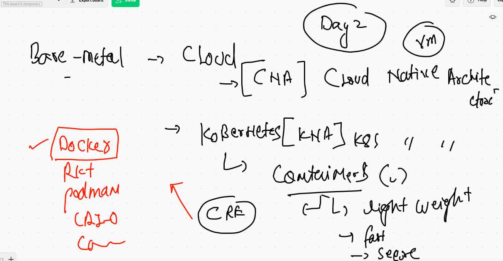
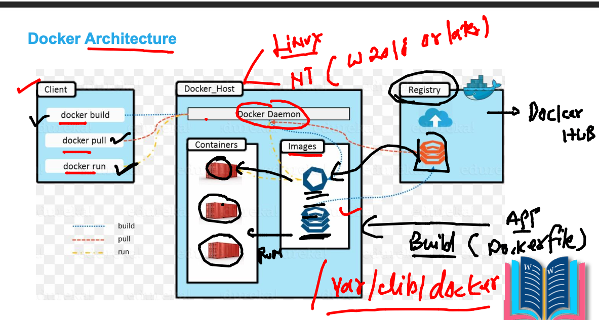
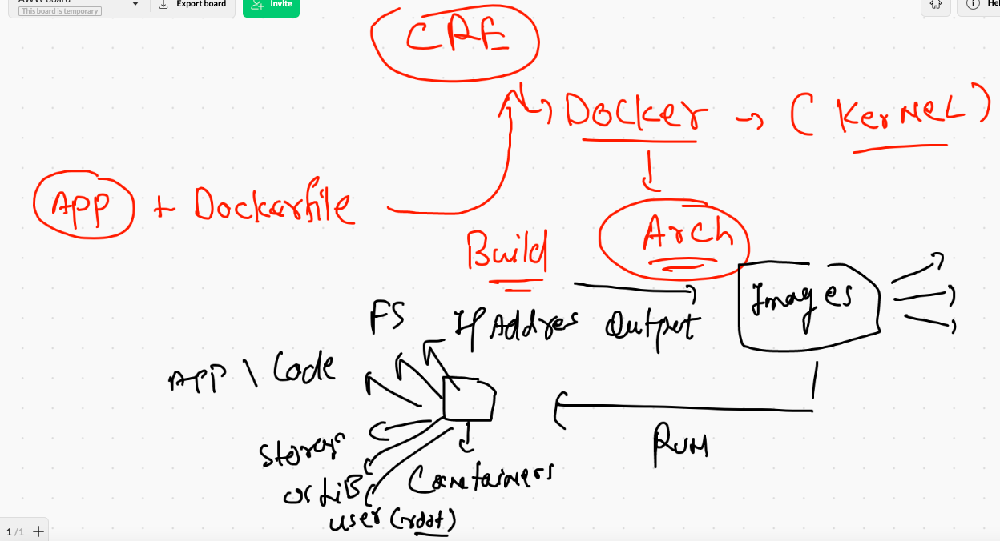
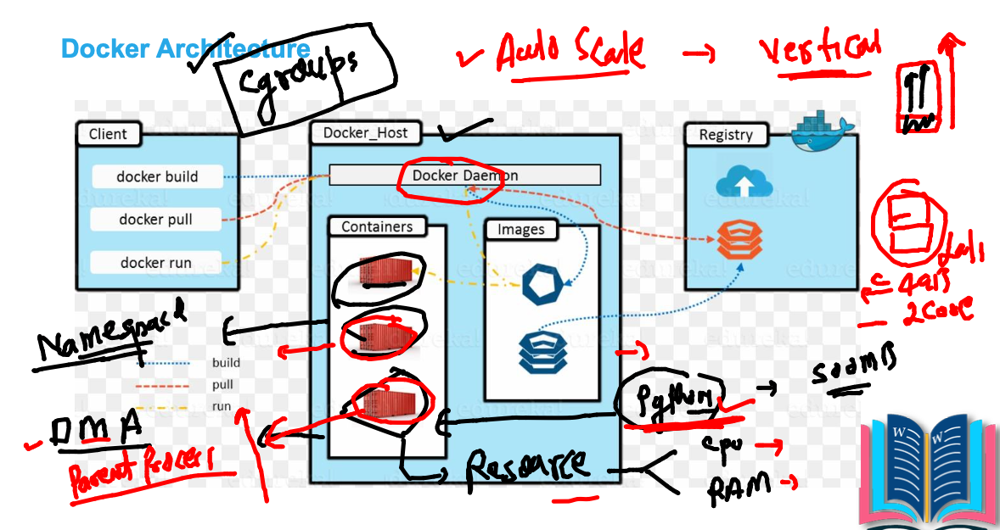
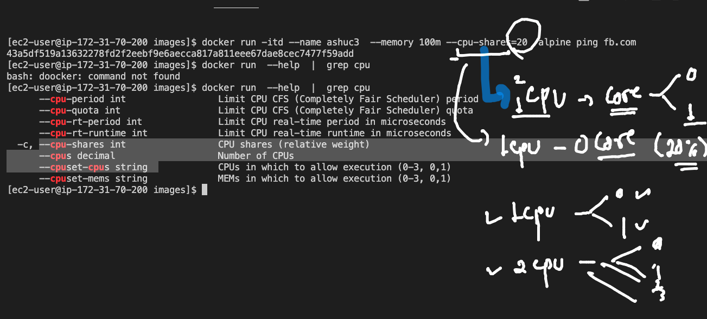

# day1 revision 

## snap 1




## snap 2 



## snap 3





## Resources distribution in containers



## cleaning up non running containers

```
[ec2-user@ip-172-31-70-200 images]$ docker rm $(docker  ps -f  "status=exited" -q)
d2ee75ee5de6
f9bf14e7d055
a3174063396d

```

## controlling resources in Container 



## demos

```
168  docker  run  -itd  --name  ashuxc3  ashupython:v3 
  169  docker  stats 
  170  history 
  171  docker  stats 
  172  history 
  173  docker run -itd --name ashuc2  --memory 100m   alpine ping fb.com
  174  docker stats
  175  history 
  176  docker run -itd --name ashuc3  --memory 100m --cpu-shares=20  alpine ping fb.com
  
```

## restart policy and json format 

```
4  docker  inspect  xx1   --format='{{.State.Status}}'
  195  docker  inspect  xx1   --format='{{.HostConfig.RestartPolicy.Name}}'
  196  docker  ps
  197  docker  inspect  srinivascg1  --format='{{.HostConfig.RestartPolicy.Name}}'
  198  docker  inspect  srinivascg1   --format='{{.State.Status}}'
  199  history 
  
```

## restart policy 

[docs](https://docs.docker.com/config/containers/start-containers-automatically/)


