# checking cluster status 

```
❯ minikube status
minikube
type: Control Plane
host: Running
kubelet: Running
apiserver: Running
kubeconfig: Configured

❯ kubectl  config get-contexts
CURRENT   NAME                          CLUSTER      AUTHINFO           NAMESPACE
*         kubernetes-admin@kubernetes   kubernetes   kubernetes-admin   
          minikube                      minikube     minikube           default
❯ kubectl  config use-context  kubernetes-admin@kubernetes
Switched to context "kubernetes-admin@kubernetes".
❯ kubectl  config get-contexts
CURRENT   NAME                          CLUSTER      AUTHINFO           NAMESPACE
*         kubernetes-admin@kubernetes   kubernetes   kubernetes-admin   
          minikube                      minikube     minikube           default
❯ kubectl  get  nodes
NAME         STATUS   ROLES                  AGE   VERSION
masternode   Ready    control-plane,master   24h   v1.21.3
minion1      Ready    <none>                 24h   v1.21.3
minion2      Ready    <none>                 24h   v1.21.3

```

## Namespace concept 

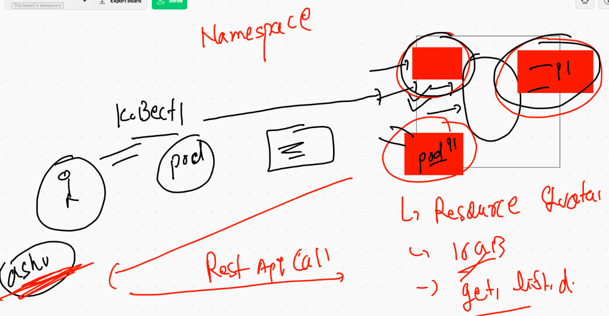

## k8s having 4 namespaces by default 

```
❯ kubectl  config get-contexts
CURRENT   NAME                          CLUSTER      AUTHINFO           NAMESPACE
*         kubernetes-admin@kubernetes   kubernetes   kubernetes-admin   
          minikube                      minikube     minikube           default
❯ kubectl  get  namespaces
NAME                   STATUS   AGE
default                Active   24h
kube-node-lease        Active   24h
kube-public            Active   24h
kube-system            Active   24h
kubernetes-dashboard   Active   18h
❯ 
❯ kubectl  config  use-context minikube
Switched to context "minikube".
❯ kubectl  get  no
NAME       STATUS   ROLES                  AGE   VERSION
minikube   Ready    control-plane,master   18h   v1.21.2
❯ kubectl  get  ns
NAME              STATUS   AGE
default           Active   18h
kube-node-lease   Active   18h
kube-public       Active   18h
kube-system       Active   18h

```

### 4 namespaces explaination 


## component of master and minion 

```
❯ kubectl  get  po -n  kube-system
NAME                                       READY   STATUS    RESTARTS   AGE
calico-kube-controllers-78d6f96c7b-rtwvd   1/1     Running   2          24h
calico-node-c9n9s                          1/1     Running   2          24h
calico-node-pzd94                          1/1     Running   2          24h
calico-node-z4ngn                          1/1     Running   2          24h
coredns-558bd4d5db-gkvfq                   1/1     Running   2          25h
coredns-558bd4d5db-lpnn5                   1/1     Running   2          25h
etcd-masternode                            1/1     Running   2          25h
kube-apiserver-masternode                  1/1     Running   2          25h
kube-controller-manager-masternode         1/1     Running   2          25h
kube-proxy-m2m4s                           1/1     Running   2          24h
kube-proxy-ps4zb                           1/1     Running   2          25h
kube-proxy-r7qck                           1/1     Running   2          25h
kube-scheduler-masternode                  1/1     Running   2          25h

```

### creating namespace

```
❯ kubectl  create  namespace  ashu-space
namespace/ashu-space created
❯ kubectl  get  ns
NAME                   STATUS   AGE
amar-space             Active   1s
ashu-space             Active   14s
default                Active   25h
kube-node-lease        Active   25h
kube-public            Active   25h
kube-system            Active   25h

```

### deploy pod in custom namespace 

```
❯ kubectl  get  po
No resources found in default namespace.
❯ kubectl  get  po -n ashu-space
NAME          READY   STATUS    RESTARTS   AGE
ashupod-123   1/1     Running   0          18s
❯ kubectl  get  po -o wide -n ashu-space
NAME          READY   STATUS    RESTARTS   AGE   IP              NODE      NOMINATED NODE   READINESS GATES
ashupod-123   1/1     Running   0          26s   192.168.34.38   minion1   <none>  

```

## setting default namespace 

```
kubectl  config  set-context  --current --namespace=ashu-space

```

## auto generate yaml / json 

```
kubectl run  webapp1  --image=dockerashu/ashuoracleweb:v111  --port=80  --dry-run=client -o yaml
apiVersion: v1
kind: Pod
metadata:
  creationTimestamp: null
  labels:
    run: webapp1
  name: webapp1
spec:
  containers:
  - image: dockerashu/ashuoracleweb:v111
    name: webapp1
    ports:
    - containerPort: 80
    resources: {}
  dnsPolicy: ClusterFirst
  restartPolicy: Always
  
  
```

### saving output in yaml file

```
kubectl run  webapp1  --image=dockerashu/ashuoracleweb:v111  --port=80  --dry-run=client -o yaml  >ashuapp1.yaml

```

### deploying pod 

```
ashuapp1.json ashuapp1.yaml ashupod1.yaml customer1
❯ kubectl  apply -f ashuapp1.yaml
pod/webapp1 created
❯ kubectl  get  po
NAME          READY   STATUS              RESTARTS   AGE
ashupod-123   1/1     Running             0          108m
webapp1       0/1     ContainerCreating   0          5s
❯ kubectl  get  po
NAME          READY   STATUS    RESTARTS   AGE
ashupod-123   1/1     Running   0          108m
webapp1       1/1     Running   0          17s
❯ kubectl  get  po -o wide
NAME          READY   STATUS    RESTARTS   AGE    IP                NODE      NOMINATED NODE   READINESS GATES
ashupod-123   1/1     Running   0          108m   192.168.34.38     minion1   <none>           <none>
webapp1       1/1     Running   0          23s    192.168.179.232   minion2   <none>           <none>

```

### history 

```
1324  kubectl version 
 1325* kubectl run  webapp1  --image=dockerashu/ashuoracleweb:v111  --port=80  --dry-run=client -o yaml
 1326* kubectl run  webapp1  --image=dockerashu/ashuoracleweb:v111  --port=80  --dry-run=client -o json 
 1327* history
 1328* kubectl run  webapp1  --image=dockerashu/ashuoracleweb:v111  --port=80  --dry-run=client -o yaml  >ashuapp1.yaml
 1329* kubectl run  webapp1  --image=dockerashu/ashuoracleweb:v111  --port=80  --dry-run=client -o json  >ashuapp1.json
 1330* ls
 1331* kubectl  apply -f ashuapp1.yaml 
 1332* kubectl  get  po 
 1333* kubectl  get  po -o wide

```
### networking in k8s 

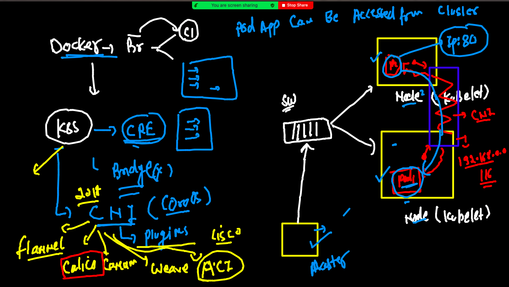

##

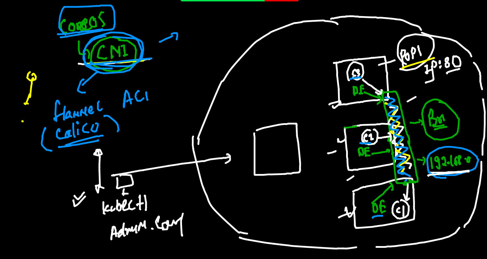

### accessing from k8s client machine 

```
 kubectl  port-forward  webapp1   9999:80
Forwarding from 127.0.0.1:9999 -> 80
Forwarding from [::1]:9999 -> 80
Handling connection for 9999
Handling connection for 9999

```

## Intro to services in k8s 

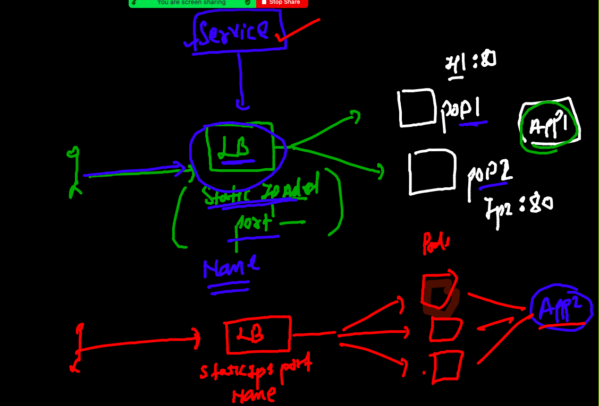

## service use label of pod to connect

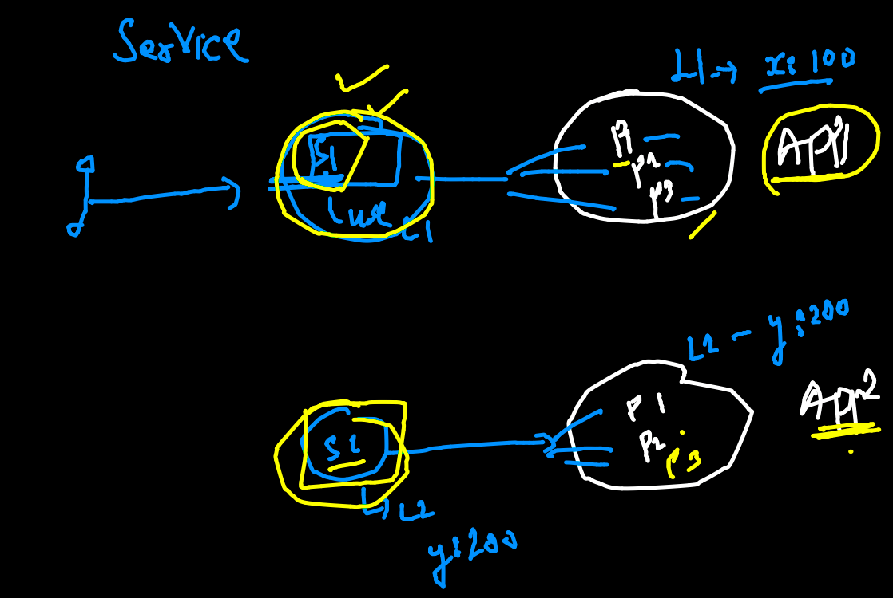

## type of service in k8s

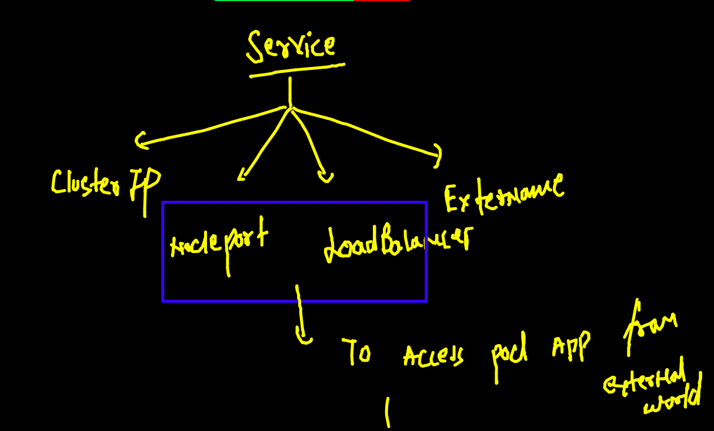

## Nodeport service with LB 

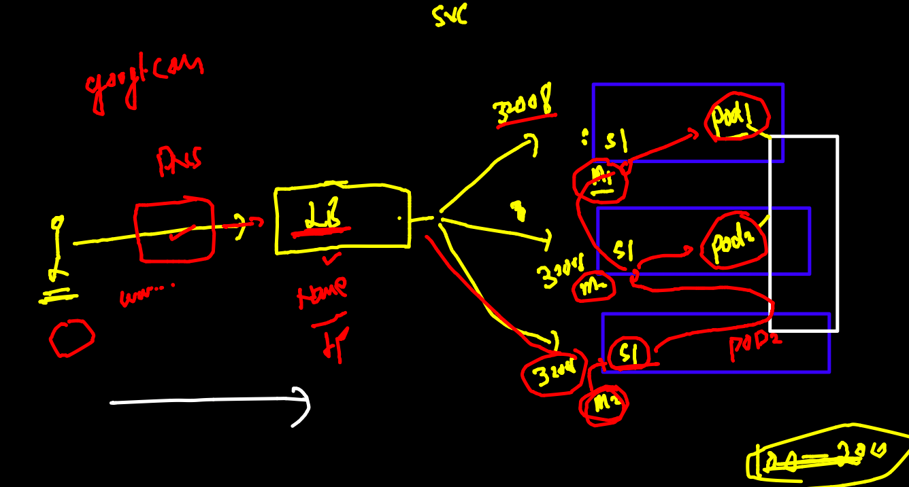

## creating service in k8s

```
❯ kubectl  create   service   nodeport  ashusvc1  --tcp  1234:80   --dry-run=client -o yaml
apiVersion: v1
kind: Service
metadata:
  creationTimestamp: null
  labels:
    app: ashusvc1
  name: ashusvc1
spec:
  ports:
  - name: 1234-80
    port: 1234
    protocol: TCP
    targetPort: 80
  selector:
    app: ashusvc1
  type: NodePort
status:
  loadBalancer: {}
❯ kubectl  create   service   nodeport  ashusvc1  --tcp  1234:80   --dry-run=client -o yaml  >svc1.yaml

```

### understanding service YAML 

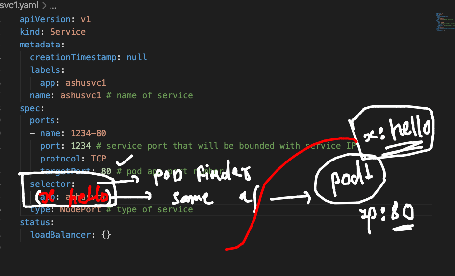

### checking lable of running pod 

```
❯ kubectl  get  po  webapp1  --show-labels
NAME      READY   STATUS    RESTARTS   AGE    LABELS
webapp1   1/1     Running   0          3h4m   run=webapp1

```

### deploy service 

```
❯ kubectl  apply -f  svc1.yaml
service/ashusvc1 created
❯ kubectl  get  service
NAME       TYPE       CLUSTER-IP       EXTERNAL-IP   PORT(S)          AGE
ashusvc1   NodePort   10.111.233.144   <none>        1234:31936/TCP   7s
❯ kubectl  get  svc
NAME       TYPE       CLUSTER-IP       EXTERNAL-IP   PORT(S)          AGE
ashusvc1   NodePort   10.111.233.144   <none>        1234:31936/TCP   12s

```

## checking pod and svc

```
❯ kubectl  get  po --show-labels
NAME          READY   STATUS    RESTARTS   AGE     LABELS
ashupod-123   1/1     Running   0          4h58m   <none>
webapp1       1/1     Running   0          3h10m   run=webapp1
❯ kubectl  get  svc -o wide
NAME       TYPE       CLUSTER-IP       EXTERNAL-IP   PORT(S)          AGE     SELECTOR
ashusvc1   NodePort   10.111.233.144   <none>        1234:31936/TCP   3m56s   run=webapp1

```

### cleanin namespace 

```
❯ kubectl  delete  svc  ashusvc1
service "ashusvc1" deleted
❯ kubectl  delete all --all
pod "ashupod-123" deleted
pod "webapp1" deleted
pod "webapp2" deleted
service "ashusvc2" deleted


```

### dashboard deployment 

```
❯ kubectl apply -f https://raw.githubusercontent.com/kubernetes/dashboard/v2.2.0/aio/deploy/recommended.yaml
namespace/kubernetes-dashboard created
serviceaccount/kubernetes-dashboard created
service/kubernetes-dashboard created
secret/kubernetes-dashboard-certs created
secret/kubernetes-dashboard-csrf created
secret/kubernetes-dashboard-key-holder created
configmap/kubernetes-dashboard-settings created
role.rbac.authorization.k8s.io/kubernetes-dashboard created
clusterrole.rbac.authorization.k8s.io/kubernetes-dashboard unchanged
rolebinding.rbac.authorization.k8s.io/kubernetes-dashboard created
clusterrolebinding.rbac.authorization.k8s.io/kubernetes-dashboard unchanged
deployment.apps/kubernetes-dashboard created
service/dashboard-metrics-scraper created
deployment.apps/dashboard-metrics-scraper created

```

### getting k8s dashboard secret 

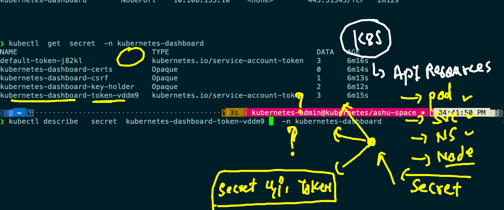

### history for dashboard deployment 

```
 1388  kubectl apply -f https://raw.githubusercontent.com/kubernetes/dashboard/v2.2.0/aio/deploy/recommended.yaml
 1389  kubectl  get  po  -n kubernetes-dashboard 
 1390  kubectl  get  svc  -n kubernetes-dashboard 
 1391  kubectl  edit  svc kubernetes-dashboard    -n kubernetes-dashboard 
 1392  kubectl  get  svc  -n kubernetes-dashboard 
 1393  kubectl  get  secret  -n kubernetes-dashboard 
 1394  kubectl describe   secret  kubernetes-dashboard-token-vddm9    -n kubernetes-dashboard 
 1395* ls
 1396* kubectl apply -f  permission.yaml
❯ 
❯ 
❯ kubectl  get  svc -n  kubernetes-dashboard
NAME                        TYPE        CLUSTER-IP       EXTERNAL-IP   PORT(S)         AGE
dashboard-metrics-scraper   ClusterIP   10.101.248.221   <none>        8000/TCP        17m
kubernetes-dashboard        NodePort    10.108.153.10    <none>        443:31545/TCP   17m

```

### Best way to deploy app in k8s

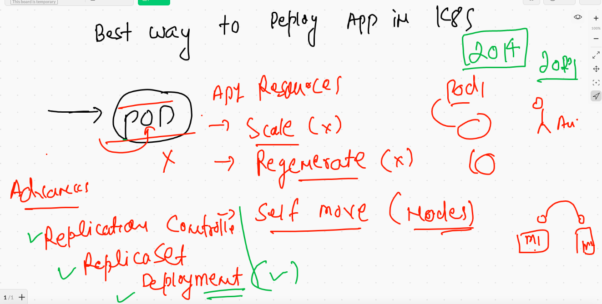

## deployment in k8s

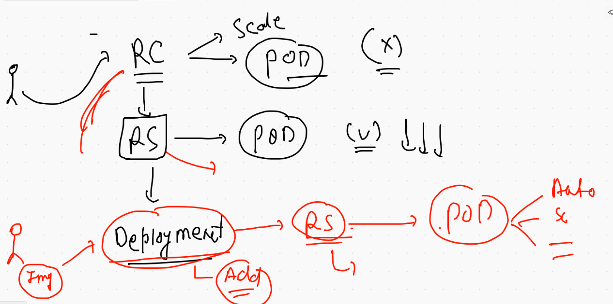

### generating deployment YAML

```
kubectl  create deployment  ashuapp2  --image=dockerashu/ashuoracleweb:v111  --dry-run=client -o yaml
apiVersion: apps/v1
kind: Deployment
metadata:
  creationTimestamp: null
  labels:
    app: ashuapp2
  name: ashuapp2
spec:
  replicas: 1
  selector:
    matchLabels:
      app: ashuapp2
  strategy: {}
  template:
    metadata:
      creationTimestamp: null
      labels:
        app: ashuapp2
    spec:
      containers:
      - image: dockerashu/ashuoracleweb:v111
        name: ashuoracleweb
        resources: {}
status: {}


```

### k8s cheatsheet URL

[URL](https://kubernetes.io/docs/reference/kubectl/cheatsheet/)

### creating deployment 

```
❯ ls
ashuapp1.json   ashuapp2.yaml   ashupod1.yaml   permission.yaml
ashuapp1.yaml   ashudep.yaml    customer1       svc1.yaml
❯ kubectl  apply -f  ashudep.yaml
deployment.apps/ashuapp2 created
service/ashusvc3 created

```

### k8s help 

```
45  kubectl  explain  pod 
 1446  kubectl  explain  pod.spec 
 1447  kubectl  explain  pod.spec.containers  
 1448  history
 1449  kubectl  explain service
 1450  kubectl  explain service.spec
 1451  history
 1452  kubectl  api-resources 
 1453  kubectl  api-resources   |  wc -l
 1454  kubectl  api-resources 

```


