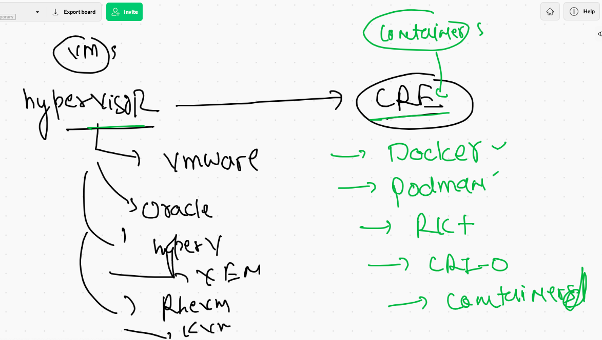

# discussion 


## problem in history based method to deploy and test any application 


## we got solution of app incompatible problem by Hypervisor 


## Os in vm means extra lib and resources 


## OS has these things in one shot


## introduction to containers


## COntainers 


## VM vs contianer engines 



## More info about Docker 


## Docker installation 


### Manual installing docker in linux vm 

```
  1  docker  version 
    2  yum  install  docker  -y
    3  for  i  in  avijit krushan mamta nurul phalani ravindra satyendra srini ; do useradd  $i ; echo "DockerOr099#"  |  pa
sswd  $i --stdin ; usermod -aG docker $i; done 
    4  ls /home
    5  vim /etc/ssh/sshd_config 
    6  systemctl restart sshd
    7  systemctl start  docker 
    8  systemctl status  docker 
    9  systemctl enable  docker 
    
 ```
 
 ## Understanding docker architecture 
 
 
 
 ## docker usage docker hub by default 
 
 
 
 ## Pulling docker iamges from docker hub 
 
 ```
 [ec2-user@ip-172-31-70-200 ~]$ docker  pull  openjdk 
Using default tag: latest
latest: Pulling from library/openjdk
c828c776e142: Pull complete 
8846dac42cae: Pull complete 
ede633318f42: Pull complete 
Digest: sha256:9667ee3dbe03be6b41ae9e855f0dbf9f2ac2b78a50a3a8b983484aeab70bdf24
Status: Downloaded newer image for openjdk:latest
docker.io/library/openjdk:latest
[ec2-user@ip-172-31-70-200 ~]$ docker  images
REPOSITORY    TAG       IMAGE ID       CREATED       SIZE
openjdk       latest    f695f4f55ff0   6 days ago    467MB
oraclelinux   8.4       845809d06ce6   6 days ago    247MB
debian        latest    7a4951775d15   3 weeks ago   114MB
[ec2-user@ip-172-31-70-200 ~]$ 

```

## container life cycle is life of app / script / code 


## docker images stored in docker host side


## creating first container 


## list of all running containers

```
[ec2-user@ip-172-31-70-200 ~]$ docker  ps
CONTAINER ID   IMAGE           COMMAND            CREATED          STATUS          PORTS     NAMES
54a8dabb04c7   alpine:latest   "ping 127.0.0.1"   47 seconds ago   Up 46 seconds             mamtac1
0d44ac7073bb   alpine:latest   "ping 127.0.0.1"   2 minutes ago    Up 2 minutes              ashuc1
c240dd2a3187   alpine:latest   "ping localhost"   4 minutes ago    Up 4 minutes              avijc1
09e4690634aa   alpine          "ping localhost"   25 minutes ago   Up 25 minutes             x1

```

### checking output of a running container 

```
 53  docker  ps
   54  docker  logs  ashuc1
   55  docker  logs  -f  ashuc1
   
```

### stopping a running container 

```
[ec2-user@ip-172-31-70-200 ~]$ docker  stop  ashuc1   
ashuc1
[ec2-user@ip-172-31-70-200 ~]$ docker  ps
CONTAINER ID   IMAGE            COMMAND            CREATED          STATUS          PORTS     NAMES
c4bbd17670c2   alpine:latest    "ping 127.0.0.1"   4 minutes ago    Up 4 minutes              phpaladu1
737512bcf2c3   alpine:latest    "ping 127.0.0.1"   5 minutes ago    Up 5 minutes              srini
530a153bddc4   busybox:latest   "ping localhost"   5 minutes ago    Up 5 minutes              avijc2
8b23d07aac19   alpine:latest    "ping 127.0.0.1"   6 minutes ago    Up 6 minutes              deepa
e41f39da3e2a   alpine:latest    "ping 127.0.0.1"   6 minutes ago    Up 6 minutes              krushna1
548a903d1cf3   ubuntu:14.04     "ping 127.0.0.1"   6 minutes ago    Up 6 minutes              satya
54a8dabb04c7   alpine:latest    "ping 127.0.0.1"   7 minutes ago    Up 7 minutes              mamtac1
c240dd2a3187   alpine:latest    "ping localhost"   11 minutes ago   Up 11 minutes             avijc1

```

### starting a container 

```
[ec2-user@ip-172-31-70-200 ~]$ docker  ps -a
CONTAINER ID   IMAGE            COMMAND                 CREATED          STATUS                        PORTS      NAMES
c4bbd17670c2   alpine:latest    "ping 127.0.0.1"        5 minutes ago    Up 5 minutes                             phpaladu1
737512bcf2c3   alpine:latest    "ping 127.0.0.1"        5 minutes ago    Up 5 minutes                             srini
530a153bddc4   busybox:latest   "ping localhost"        6 minutes ago    Up 6 minutes                             avijc2
8b23d07aac19   alpine:latest    "ping 127.0.0.1"        6 minutes ago    Exited (137) 35 seconds ago              deepa
e41f39da3e2a   alpine:latest    "ping 127.0.0.1"        7 minutes ago    Up 7 minutes                             krushna1
548a903d1cf3   ubuntu:14.04     "ping 127.0.0.1"        7 minutes ago    Up 7 minutes                             satya
54a8dabb04c7   alpine:latest    "ping 127.0.0.1"        8 minutes ago    Up 8 minutes                             mamtac1
0d44ac7073bb   alpine:latest    "ping 127.0.0.1"        9 minutes ago    Exited (137) 50 seconds ago              ashuc1
c240dd2a3187   alpine:latest    "ping localhost"        12 minutes ago   Up 12 minutes                            avijc1
c9759da887e1   tomcat           "x1 'ping localhost'"   24 minutes ago   Created                       8080/tcp   thirsty_proskuriakova
09e4690634aa   alpine           "ping localhost"        32 minutes ago   Up 32 minutes                            x1
79581fbe2d70   fedora           "/bin/bash"             35 minutes ago   Up 34 minutes                            charming_kare
[ec2-user@ip-172-31-70-200 ~]$ docker  start  ashuc1
ashuc1
[ec2-user@ip-172-31-70-200 ~]$ docker  ps 
CONTAINER ID   IMAGE            COMMAND            CREATED          STATUS          PORTS     NAMES
c4bbd17670c2   alpine:latest    "ping 127.0.0.1"   5 minutes ago    Up 5 minutes       

```

### access shell of a running container 

```
[ec2-user@ip-172-31-70-200 ~]$ docker  exec  -it   ashuc1  sh 
/ # uname
Linux
/ # whoami
root
/ # cat  /etc/os-release 
NAME="Alpine Linux"
ID=alpine
VERSION_ID=3.14.0
PRETTY_NAME="Alpine Linux v3.14"
HOME_URL="https://alpinelinux.org/"
BUG_REPORT_URL="https://bugs.alpinelinux.org/"
/ # ls  /
bin    etc    lib    mnt    proc   run    srv    tmp    var
dev    home   media  opt    root   sbin   sys    usr
/ # exit

```

## Docker client options 


## removing all containers from docker engine 

```
[ec2-user@ip-172-31-70-200 ~]$ docker rm $(docker ps -aq) -f

```

## app containerization 


## app to image


## Building first docker image for python code 

```
[ec2-user@ip-172-31-70-200 pythoncode]$ ls
Dockerfile  hello.py
[ec2-user@ip-172-31-70-200 pythoncode]$ docker  build  -t   ashupython:v1  .
Sending build context to Docker daemon  3.584kB
Step 1/6 : FROM python
 ---> d92f72c38f7e
Step 2/6 : LABEL  name="ashutoshh singh"
 ---> Running in 54c37ee7ff19
Removing intermediate container 54c37ee7ff19
 ---> d9baa43b70c0
Step 3/6 : LABEL email="ashutoshh@linux.com"
 ---> Running in ca04ecf42982
Removing intermediate container ca04ecf42982
 ---> 989281d997c9
Step 4/6 : RUN  mkdir /code
 ---> Running in d5033e75256b
Removing intermediate container d5033e75256b
 ---> 2ce944e52d17
Step 5/6 : COPY hello.py  /code/hello.py
 ---> f16386a28323
Step 6/6 : CMD ["python","/code/hello.py"]
 ---> Running in 5b743c09bd64
Removing intermediate container 5b743c09bd64
 ---> 0f2c636ef0d4
Successfully built 0f2c636ef0d4
Successfully tagged ashupython:v1

```

### Dockerfile example 1

```

FROM oraclelinux:8.3 
LABEL  name="ashutoshh singh"
LABEL email="ashutoshh@linux.com"
RUN dnf install python3 -y
RUN  mkdir /code
COPY hello.py  /code/hello.py
CMD ["python3","/code/hello.py"]

```

## Dockerfile example 2 

```
FROM python
# We are going to user python docker image
# it will be pulled from Docker hub if not present 
# in Docker engine host 
LABEL  name="ashutoshh singh"
LABEL email="ashutoshh@linux.com"
# just info about image designer 
# this field is optional 
RUN  mkdir /code
# during image build time it will give you 
# container shell access like docker exec -it 
COPY hello.py  /code/hello.py
# copy data from docker client machine to
# docker engine during build time 
# its like docker cp -- 
CMD ["python","/code/hello.py"]

```

### if file name is not Dockerfile 

```
[ec2-user@ip-172-31-70-200 pythoncode]$ docker  build  -t   ashupython:v2 -f ashupython.dockerfile  .Sending build context to Docker daemon  4.608kB
Step 1/7 : FROM oraclelinux:8.3
 ---> 816d99f0bbe8
Step 2/7 : LABEL  name="ashutoshh singh"
 ---> Running in 803d5831071b
Removing intermediate container 803d5831071b
 ---> 1cc70e2b1f33
Step 3/7 : LABEL email="ashutoshh@linux.com"
 ---> Running in f26813a468cc
Removing intermediate container f26813a468cc

```

### creating container 

```
 113  docker  images
  114  docker  run  -itd  --name  ashuxc1  ashupython:v1  
  115  docker  ps
  116  docker  run  -itd  --name  ashuxc2  ashupython:v2  
  117  docker  ps
  118  docker  run  -itd  --name  ashuxc3  ashupython:v3  
  119  docker ps
  120  history 
[ec2-user@ip-172-31-70-200 pythoncode]$ docker  ps
CONTAINER ID   IMAGE             COMMAND                  CREATED          STATUS          PORTS     NAMES
ac3cfc2cb055   ashupython:v3     "python3 /code/hello…"   13 seconds ago   Up 12 seconds             ashuxc3
a93ab0f9ff55   satyapython3:v3   "python3 /code/hello…"   15 seconds ago   Up 14 seconds             satyatest1
3e2438671fd6   ashupython:v2     "python3 /code/hello…"   30 seconds ago   Up 29 seconds             ashuxc2
6fa70b74e041   kruspython:v1     "python /code/hello.…"   50 seconds ago   Up 49 seconds             krushnac1
33b85e19cb66   ashupython:v1     "python /code/hello.…"   54 seconds ago   Up 53 seconds             ashuxc1

```


