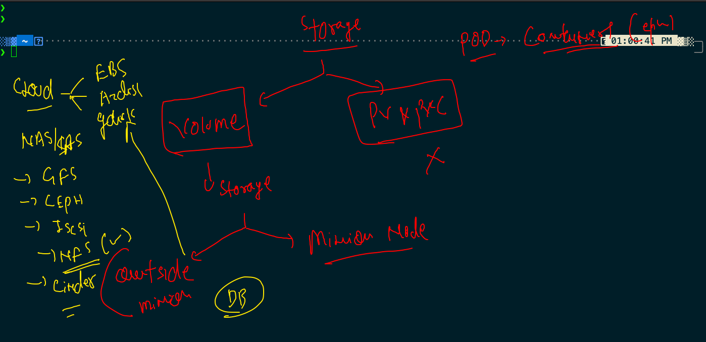

# summary of containerization and orchestration 


## Load balancer 


## Lb svc in k8s


## creating service using expose 

```
88  kubectl delete svc --all
 1489  kubectl get svc
 1490  kubectl get deploy 
 1491  kubectl  expose deploy  ashuapp2  --type NodePort --port 80  --name ashusvc1
 1492  kubectl  get  svc
 1493  kubectl  expose deploy  ashuapp2  --type LoadBalancer --port 80  --name ashusvc2
 1494  kubectl get svc

```

# manual scaling 

```
❯ kubectl  get  deploy
NAME       READY   UP-TO-DATE   AVAILABLE   AGE
ashuapp2   1/1     1            1           17h
❯ kubectl scale deploy  ashuapp2  --replicas=3
deployment.apps/ashuapp2 scaled
❯ kubectl  get  deploy
NAME       READY   UP-TO-DATE   AVAILABLE   AGE
ashuapp2   3/3     3            3           17h
❯ kubectl  get po
NAME                        READY   STATUS    RESTARTS   AGE
ashuapp2-5447988499-9rfsg   1/1     Running   0          8s
ashuapp2-5447988499-gkxfv   1/1     Running   1          17h
ashuapp2-5447988499-rm67t   1/1     Running   0          8s

```
## Bulding javaweb from Github 

```
docker build  -t  ashujavaweb:v1 https://github.com/redashu/javawebapp.git

```
## Pushing image to OCR 

### tag image 

```
❯ docker  tag  ashujavaweb:v1   phx.ocir.io/axmbtg8judkl/javaweb:v1
❯ docker  images
REPOSITORY                         TAG              IMAGE ID       CREATED          SIZE
phx.ocir.io/axmbtg8judkl/javaweb   v1               e0931e59228f   13 minutes ago   668MB

```

### login to ocr 

```

docker  login   phx.ocir.io  -u  axmbtg8judkl/learntechbyme@gmail.com
Password: 
Login Succeeded
```

### pushing image to OCR

```
 docker  push  phx.ocir.io/axmbtg8judkl/javaweb:v1
The push refers to repository [phx.ocir.io/axmbtg8judkl/javaweb]
03b18e74bff0: Pushed 
5f70bf18a086: Pushed 
fa90e3ccdb7d: Pushed 
a9502f3f1738: Pushed 
26cdef4ed0c4: Pushing [===============

```

### private image can't be pulled by kubelet 


### exposing deploy to create service

```
❯ kubectl  get deploy
NAME         READY   UP-TO-DATE   AVAILABLE   AGE
ashuapp111   1/1     1            1           24m
❯ kubectl  expose deploy ashuapp111  --type NodePort --port 8080  --name ashusvc999
service/ashusvc999 exposed
❯ kubectl  get  svc
NAME         TYPE       CLUSTER-IP      EXTERNAL-IP   PORT(S)          AGE
ashusvc999   NodePort   10.111.84.117   <none>        8080:30294/TCP   5s

```

## Storage in k8s 



### storage based use cases


## k8s in cloud as a service 


### creating pod with custom process


### few more kubectl action 

```
574  kubectl apply -f  alpine.yaml
 1575  kubectl replace  -f  alpine.yaml --force
 1576  kubectl get  po 
 1577  kubectl  logs -f  hellopod1
 1578  history
 1579  kubectl  get  po 
 1580  kubectl exec -it  hellopod1  -- sh 
 
 ```
 
 ### emptyDir volume type
 
 
 
 ### sidecar container 
 
 
 
### multi container pod 


## connecting multi container insde pod 

```
❯ kubectl  get  po
NAME        READY   STATUS    RESTARTS   AGE
hellopod1   2/2     Running   0          47s
❯ kubectl  exec -it  hellopod1  -- bash
Defaulted container "ashuc1" out of: ashuc1, hellopod1
root@hellopod1:/# cat  /etc/os-release 
PRETTY_NAME="Debian GNU/Linux 10 (buster)"
NAME="Debian GNU/Linux"
VERSION_ID="10"
VERSION="10 (buster)"
VERSION_CODENAME=buster
ID=debian
HOME_URL="https://www.debian.org/"
SUPPORT_URL="https://www.debian.org/support"
BUG_REPORT_URL="https://bugs.debian.org/"
root@hellopod1:/# cd  /usr/share/nginx/html/
root@hellopod1:/usr/share/nginx/html# ls
time.txt
root@hellopod1:/usr/share/nginx/html# exit
exit
❯ kubectl  exec -it  hellopod1 -c  hellopod1  -- sh
/ # cat  /etc/os-release 
NAME="Alpine Linux"
ID=alpine
VERSION_ID=3.14.0
PRETTY_NAME="Alpine Linux v3.14"
HOME_URL="https://alpinelinux.org/"
BUG_REPORT_URL="https://bugs.alpinelinux.org/"
/ # cd  /mnt/oracle/
/mnt/oracle # ls
time.txt
/mnt/oracle # exit


```

## exposing service for nginx container only 

```
❯ kubectl  expose pod  hellopod1  --type NodePort --port 80 --name ashusvc1
service/ashusvc1 exposed
❯ kubectl get  svc
NAME       TYPE       CLUSTER-IP      EXTERNAL-IP   PORT(S)        AGE
ashusvc1   NodePort   10.108.236.74   <none>        80:32482/TCP   4s


```

