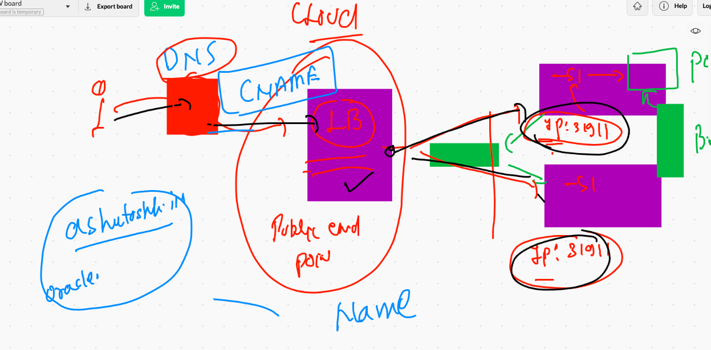

# summary of containerization and orchestration 


## Load balancer 



## Lb svc in k8s


## creating service using expose 

```
88  kubectl delete svc --all
 1489  kubectl get svc
 1490  kubectl get deploy 
 1491  kubectl  expose deploy  ashuapp2  --type NodePort --port 80  --name ashusvc1
 1492  kubectl  get  svc
 1493  kubectl  expose deploy  ashuapp2  --type LoadBalancer --port 80  --name ashusvc2
 1494  kubectl get svc

```

# manual scaling 

```
❯ kubectl  get  deploy
NAME       READY   UP-TO-DATE   AVAILABLE   AGE
ashuapp2   1/1     1            1           17h
❯ kubectl scale deploy  ashuapp2  --replicas=3
deployment.apps/ashuapp2 scaled
❯ kubectl  get  deploy
NAME       READY   UP-TO-DATE   AVAILABLE   AGE
ashuapp2   3/3     3            3           17h
❯ kubectl  get po
NAME                        READY   STATUS    RESTARTS   AGE
ashuapp2-5447988499-9rfsg   1/1     Running   0          8s
ashuapp2-5447988499-gkxfv   1/1     Running   1          17h
ashuapp2-5447988499-rm67t   1/1     Running   0          8s

```

